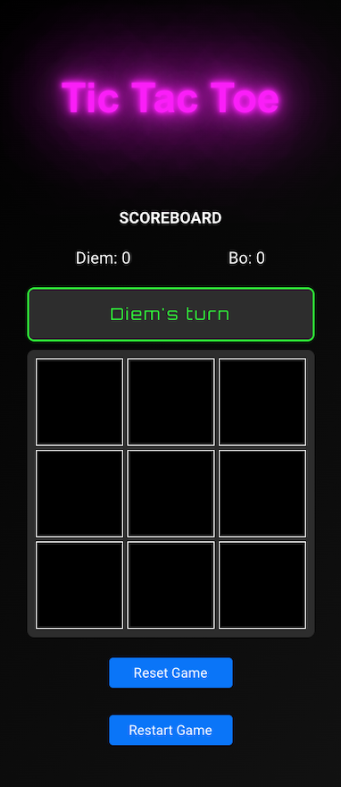
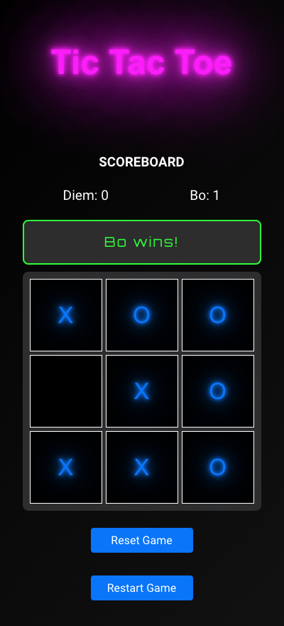

# Tic Tac Toe Game

This project is a Tic Tac Toe game created for a school assignment. It is built using the Vue framework and showcases the use of states and props to manage game logic and UI updates. The game is designed with a retro, 80s/90s video game aesthetic, featuring neon colors for that nostalgic old-school look.

## Features

- Kunna ange spelarnamn för X respektive O
- Kunna spela ett spel och få en vinnare/oavgjort
- Inte kunna göra fler drag efter spelet är slut
- Kunna starta ett nytt spel
- Använda minst en komponent

## Tech Stack

- Använda minst tre komponenter för er lösning
- Spara poänghistorik för spelarna
- Kunna visa poängstatistiken
- Kunna stänga webbläsaren och komma tillbaka där spelet avbröts
- Kunna nollställa statistik och börja om med nya spelare

## Getting Started

### Prerequisites
Node.js and npm are required to run this project locally.

### Installation
1. Clone the repository:
git clone https://github.com/
2. Navigate to the project directory:
cd 
3. Install dependencies:
npm i

### Running the Game
To start the game locally, run:
npm run dev

Then, open your browser and go to the link to play the game.

## How It Works

- The game uses Vue's state management to handle the game board, score, and player turns.
- Props are used to pass data between components, ensuring smooth communication between different parts of the UI.
- Local Storage stores the score and game history, allowing the player to close and reopen the game without losing progress.
- The reset feature clears the game board and resets all data for a new game session.

## Screenshots

